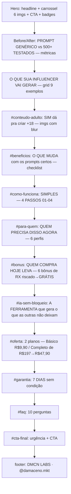

# Pages Map — Estrutura (single-page, React SPA)

Página única (sem branching). 14 blocos na ordem:

Tom/estratégia: low-ticket BR, prova por imagem, decoy de 2 planos (Básico fraco vs Completo "MAIS ESCOLHIDO"), +18 como gancho central, garantia 7 dias, urgência final.
